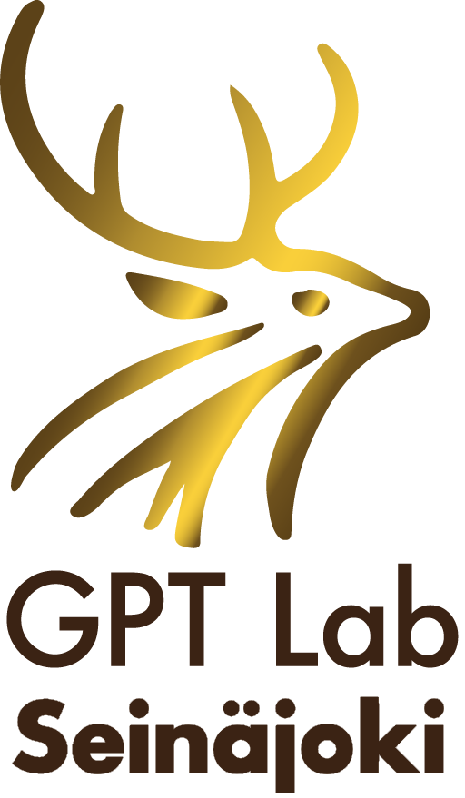

# GPT Lab Seinäjoki

**This project under the GPT Lab Seinäjoki program supports the regional strategy of fostering an innovative ecosystem and advancing smart, skilled development. Its goal is to introduce new AI knowledge and technology to the region, enhance research and innovation activities, and improve business productivity.**

